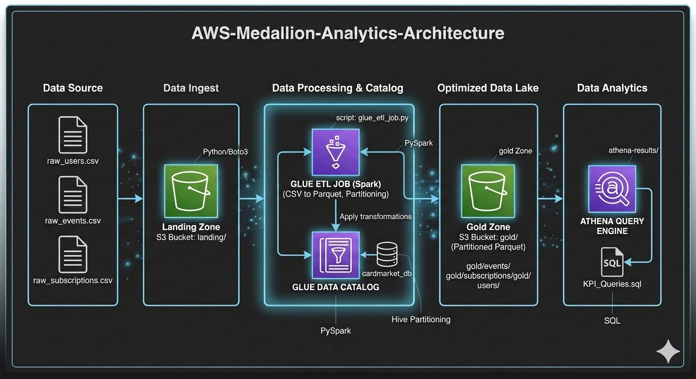

# AWS Medallion Analytics Architecture: CloudScale Pipeline

### 🚀 Project Overview
This project implements a fully automated, end-to-end data pipeline on AWS designed to process large-scale marketplace data. By leveraging the **Medallion (Bronze/Silver/Gold) Architecture**, the pipeline transforms raw transaction data into high-performance, cost-optimized datasets for business intelligence.

### 🏗️ Architecture Diagram


### 🛠️ Technical Stack & Tools
*   **Storage:** AWS S3 (Landing, Bronze, and Gold zones).
*   **Compute/ETL:** AWS Glue (PySpark) for schema enforcement and data transformation.
*   **Query Engine:** AWS Athena for serverless SQL analytics.
*   **Format:** Optimized **Apache Parquet** with Snappy compression.
*   **Partitioning:** Hive-style partitioning by `Year/Month/Day`.

### 📈 Business KPIs Delivered
The pipeline was built to calculate and automate critical business metrics:
*   **Monthly Recurring Revenue (MRR):** Automated tracking of revenue growth.
*   **User Engagement:** SQL-driven analysis of active users and churn rates.
*   **Cost Efficiency:** Transitioned storage from CSV to Parquet, reducing query data scans by **over 90%** and significantly lowering AWS costs.

### 📂 Project Structure
*   `/scripts`: Contains the AWS Glue PySpark ETL job.
*   `/sql`: High-performance Athena queries for KPI reporting.
*   `/data_samples`: Small-scale samples of raw vs. processed data for demonstration.

---

### 🔧 How to Run
1. **S3 Setup:** Upload raw CSV files to the `landing/` bucket.
2. **Glue Job:** Run the `glue_etl_job.py` to trigger the transformation into the Gold zone.
3. **Analytics:** Use the provided SQL scripts in Amazon Athena to query the partitioned Parquet data.

### 1. Final Project Structure
Before pushing, ensure your local folder `D:\Downloads\Cardmarket_Project` is organized like this:
```text
/cardmarket-data-pipeline
├── architecture.png         <-- (The graph you recreate in Eraser.io)
├── /scripts
│   └── glue_etl_job.py      <-- (Your Spark code)
├── /sql
│   ├── mrr_report.sql       <-- (Athena SQL)
│   └── user_engagement.sql
├── /data_samples            <-- (Keep these small, ~5-10 rows)
│   ├── raw_users_sample.csv
│   └── mrr_output_sample.csv
└── README.md
